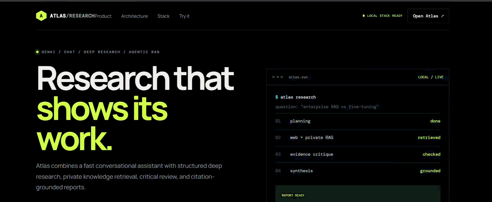

<h1>
  
</h1>

<strong>A local-first AI workspace for conversational chat, evidence-driven research, and private-document retrieval.</strong>

  
  
  
  
  

  <a href="#-website-slideshow">Website slideshow</a> ·
  <a href="#-at-a-glance">Overview</a> ·
  <a href="#-capabilities">Capabilities</a> ·
  <a href="#-quick-start">Quick start</a> ·
  <a href="#-architecture">Architecture</a> ·
  <a href="#-api-reference">API</a> ·
  <a href="#-troubleshooting">Troubleshooting</a>

---

## 🎞️ Website slideshow

The zoomed-in, high-resolution preview crops away browser chrome and empty side margins so the website is easier to read. It now slides right-to-left through four screens: the landing page, chat, a research prompt, and the generated report.

 

Click the preview or button to open the full screen recording on GitHub.

## 🧭 At a glance

Atlas Research AI brings chat, research orchestration, and retrieval-augmented generation (RAG) together in one web application. It can use a language model served locally by [LM Studio](https://lmstudio.ai/), gather web evidence through an optional search integration, and retrieve relevant passages from your own documents.

> **What this project is:** an AI application and orchestration layer built around existing language models. It is not a foundation model trained from scratch.

| | Capability | What it does |
|---|---|---|
| 💬 | Conversational chat | Sends messages to a model through LM Studio's OpenAI-compatible API. |
| 🧠 | Research workflow | Coordinates planning, evidence gathering, critique, synthesis, and response checks with LangGraph. |
| 🌐 | Web discovery | Optionally searches the web with DDGS and incorporates available evidence. |
| 📚 | Personal knowledge base | Ingests PDF, TXT, and Markdown files, chunks the text, embeds it, and retrieves relevant passages. |
| 🔎 | Evidence-aware responses | Returns source details alongside research results when available. |
| 🗃️ | Vector retrieval | Stores and searches document embeddings with Qdrant. |
| 🏠 | Local-first inference | Keeps model inference on your machine when LM Studio is configured locally. |
| 🩺 | Service health | Exposes API and model-connection checks to help diagnose setup issues. |

## ✨ Capabilities

### Chat with a local model
Connect to any compatible model loaded in LM Studio. The example configuration uses Qwen3-4B, but the model ID must match the one reported by your local LM Studio server.

### Research with an explicit workflow
LangGraph coordinates the research process: plan the question, gather web and document evidence, critique the results, and synthesize an answer. The number of sources and research rounds is configurable.

### Ask questions about your documents
Upload PDF, TXT, or Markdown files and retrieve relevant chunks with embeddings and Qdrant-backed vector search. Scanned PDFs without an extractable text layer are not currently supported.

### Keep the components understandable
A Next.js frontend communicates with a FastAPI backend. Model calls, retrieval, research state, and search tools are separated into distinct modules, making the codebase easier to test and extend.

## 🧰 Technology stack

| Layer | Technologies |
|---|---|
| Frontend | Next.js, React, TypeScript |
| API | Python, FastAPI, Uvicorn, Pydantic |
| Research orchestration | LangGraph, LangChain Core |
| Model runtime | LM Studio OpenAI-compatible API |
| Embeddings and retrieval | FastEmbed, Qdrant |
| Document ingestion | pypdf, text chunking |
| Optional web search | DDGS |
| Quality checks | pytest, pytest-asyncio, Ruff |
| Local infrastructure | Docker Compose |

## 🏗️ Architecture

~~~mermaid
flowchart TD
    USER["User"] --> UI["Next.js + React"]
    UI <--> API["FastAPI"]
    API --> CHAT["Chat endpoint"]
    API --> RESEARCH["LangGraph research workflow"]
    CHAT --> LLM["LM Studio API"]
    CHAT -. optional private context .-> QDRANT["Qdrant"]
    RESEARCH --> PLAN["Plan question"]
    PLAN --> EVIDENCE["Gather evidence"]
    EVIDENCE --> WEB["DDGS web search"]
    EVIDENCE --> QDRANT
    QDRANT <--> EMBED["FastEmbed"]
    WEB --> CRITIQUE["Critique evidence"]
    QDRANT --> CRITIQUE
    CRITIQUE --> SYNTH["Synthesize response"]
    SYNTH --> LLM
    LLM --> RESULT["Answer + available sources"]
    RESULT --> UI
~~~

The research loop can gather more evidence when configured to do so. Fast local mode reduces extra model calls; depth and quality depend on the loaded model, source availability, and configured limits.

## 🚀 Quick start

### Requirements

Install these before starting:

- **Python 3.11 or newer** for the API and research workflow
- **Node.js 20.9 or newer** for the frontend
- **Docker Desktop** (or Docker Engine with Compose) for Qdrant
- **LM Studio** with a compatible model downloaded and loaded
- **Git** to clone the project

Official setup links: [Python](https://www.python.org/downloads/) · [Node.js](https://nodejs.org/en/download) · [Docker Desktop](https://www.docker.com/products/docker-desktop/) · [LM Studio](https://lmstudio.ai/) · [Git](https://git-scm.com/downloads)

### 1. Clone this repository

~~~bash
git clone https://github.com/Sai-Srinivas-P/ATLAS-RESEARCH-AI.git
cd ATLAS-RESEARCH-AI
~~~

### 2. Prepare the backend environment

**Windows PowerShell:**

~~~powershell
py -3.11 -m venv .venv
.\.venv\Scripts\Activate.ps1
python -m pip install --upgrade pip
python -m pip install -e ".[search,dev]"
Copy-Item .env.example .env
~~~

**macOS / Linux:**

~~~bash
python3 -m venv .venv
source .venv/bin/activate
python -m pip install --upgrade pip
python -m pip install -e ".[search,dev]"
cp .env.example .env
~~~

If PowerShell blocks activation, run `Set-ExecutionPolicy -Scope Process -ExecutionPolicy Bypass` in that terminal, then activate the environment again.

### 3. Start LM Studio

1. Open LM Studio and download a chat/instruct model that fits your hardware. The example settings reference **Qwen3-4B**.
2. Load the model and verify that it answers in LM Studio's Chat tab.
3. Open the Developer tab and start the local server, usually at `http://127.0.0.1:1234`.
4. Ensure the API base URL in `.env` is `http://127.0.0.1:1234/v1`.

**Model ID tip:** the exact ID varies by downloaded model or preset. Check `http://127.0.0.1:1234/v1/models`, then set `LM_STUDIO_MODEL` in `.env` to the returned ID. You can use `auto` if the project configuration supports selecting the first model returned by the server.

See the [LM Studio getting-started guide](https://lmstudio.ai/docs/app/basics) and [local API server guide](https://lmstudio.ai/docs/developer/core/server).

### 4. Configure environment variables

Review the root `.env` file. These are example values from `.env.example`:

~~~dotenv
LM_STUDIO_URL=http://127.0.0.1:1234/v1
LM_STUDIO_MODEL=qwen/qwen3-4b
LM_STUDIO_API_KEY=lm-studio
LM_STUDIO_MAX_TOKENS=500

LOCAL_FAST_MODE=true
MAX_RESEARCH_SOURCES=6
MAX_RESEARCH_ROUNDS=1
REQUEST_TIMEOUT_SECONDS=60

QDRANT_URL=http://127.0.0.1:6333
QDRANT_COLLECTION=atlas_documents_lmstudio

EMBEDDING_MODEL=BAAI/bge-small-en-v1.5
EMBEDDING_DIMENSIONS=384
RAG_TOP_K=5
CHUNK_SIZE=1000
CHUNK_OVERLAP=150

ATLAS_HOST=0.0.0.0
ATLAS_PORT=8000
~~~

The `lm-studio` API key above is a local placeholder for compatible clients, not a secret or a substitute for securing any service exposed to a network. Never commit real credentials.

### 5. Start Qdrant

~~~bash
docker compose up -d qdrant
~~~

Qdrant's local HTTP endpoint should be reachable at `http://127.0.0.1:6333`. The first embedding operation may download the configured FastEmbed model, so initial indexing may need internet access.

### 6. Start the API

From the repository root, with the virtual environment activated:

~~~bash
python -m uvicorn atlas_research.api:app --host 127.0.0.1 --port 8000 --reload
~~~

Check the backend:

- Health: [http://127.0.0.1:8000/health](http://127.0.0.1:8000/health)
- LM Studio connection: [http://127.0.0.1:8000/health/lm-studio](http://127.0.0.1:8000/health/lm-studio)
- Interactive API docs: [http://127.0.0.1:8000/docs](http://127.0.0.1:8000/docs)

### 7. Start the frontend

Open a second terminal:

~~~bash
cd frontend
npm install
~~~

Optionally create `frontend/.env.local`:

~~~dotenv
NEXT_PUBLIC_API_URL=http://127.0.0.1:8000
~~~

Then run:

~~~bash
npm run dev
~~~

Open **http://localhost:3000**. Keep the frontend, backend, Qdrant, and LM Studio running while using the app.

## 🐳 Docker setup

The Dockerfile and Compose configuration support a containerized backend and Qdrant. When the backend runs inside Docker, use service/container-reachable addresses in the root `.env`:

~~~dotenv
LM_STUDIO_URL=http://host.docker.internal:1234/v1
QDRANT_URL=http://qdrant:6333
~~~

Then run:

~~~bash
docker compose up --build
~~~

The frontend is started separately using the steps above. On Linux, `host.docker.internal` can require extra host-gateway configuration. When running the backend directly on your computer instead, use the normal local URLs from `.env.example` and start only Qdrant with Compose.

## ✅ Verify the setup

Run from the repository root with development dependencies installed:

~~~bash
python -m pytest -q
python -m ruff check .
~~~

Build the frontend separately:

~~~bash
cd frontend
npm run build
~~~

For an end-to-end check, confirm that `/health/lm-studio` reports a healthy connection, send a message through the `/chat` endpoint, and try a small text-based document upload in the UI.

## 🔌 API reference

FastAPI's live interactive schema is available at `/docs` while the API is running.

| Method | Endpoint | Purpose |
|---|---|---|
| `GET` | `/health` | Check whether the API is responding. |
| `GET` | `/health/lm-studio` | Check the connection to the model server. |
| `POST` | `/chat` | Generate a conversational response, optionally using private context. |
| `POST` | `/research` | Run the LangGraph evidence-gathering workflow. |
| `POST` | `/documents/upload` | Upload and index a PDF, TXT, or Markdown file. |
| `GET` | `/documents` | List indexed documents. |
| `DELETE` | `/documents/{filename}` | Delete an indexed document. |

Use `/docs` for the exact request and response schemas exposed by the running version.

## 📂 Project structure

~~~text
ATLAS-RESEARCH-AI/
├── assets/                 # Branding and project assets
├── frontend/               # Next.js + React + TypeScript app
├── src/atlas_research/
│   ├── api.py              # FastAPI routes
│   ├── config.py           # Environment-based settings
│   ├── graph.py            # LangGraph research workflow
│   ├── llm.py              # LM Studio client
│   ├── models.py           # API request / response models
│   ├── rag.py               # Document ingestion and retrieval
│   ├── state.py             # Research workflow state
│   └── tools.py             # Search tools
├── tests/                   # Automated tests
├── evals/                   # Evaluation assets
├── scripts/                 # Helper scripts
├── .env.example             # Safe example configuration
├── Dockerfile
├── docker-compose.yml
├── pyproject.toml
└── README.md
~~~

## 🔐 Privacy and responsible use

- **Local model inference:** with a local LM Studio configuration, prompts are sent to the model server running on your machine.
- **Web search is not offline:** when DDGS is enabled, search queries are sent to the search provider.
- **Document storage:** indexed chunks and vectors live in the configured Qdrant instance. Protect its API and storage.
- **Model downloads:** FastEmbed may download model files during first use.
- **Keep secrets out of Git:** use `.env.example` for safe placeholders; do not commit real tokens, credentials, or private data.
- **Review generated work:** verify important claims and sources independently before relying on them.

## 🧯 Troubleshooting

| Symptom | Things to check |
|---|---|
| Frontend can't reach the API | Confirm the backend is running on port 8000 and check `NEXT_PUBLIC_API_URL`. |
| LM Studio health check fails | Load a model, start the local server, check `/v1/models`, and match `LM_STUDIO_MODEL` to the returned ID. |
| Docker backend can't reach LM Studio | Use `host.docker.internal` instead of `127.0.0.1` inside the container. |
| Qdrant connection fails | Check that Compose is running and that `QDRANT_URL` matches how the backend is deployed. |
| First document upload is slow | FastEmbed may be downloading its embedding model; give the first run time to complete. |
| A PDF returns no useful text | Scanned/image-only PDFs need an OCR/text layer, which this project does not currently provide. |

## 🗺️ Roadmap ideas

- Richer source inspection and citation navigation
- More evaluation cases for research quality and grounding
- Improved document ingestion and retrieval controls
- Optional deployment profiles for different local model runtimes

## 🤝 Contributing

1. Create a focused branch for the change.
2. Add or update tests when behavior changes.
3. Run `python -m pytest -q`, `python -m ruff check .`, and `npm run build` for frontend changes.
4. Open a pull request with the motivation, implementation details, and any trade-offs.

---

**Built for curious minds that want their research workflow to stay transparent and close to home.**

Atlas Research AI · Local-first chat · Evidence-focused research · Private-document retrieval

